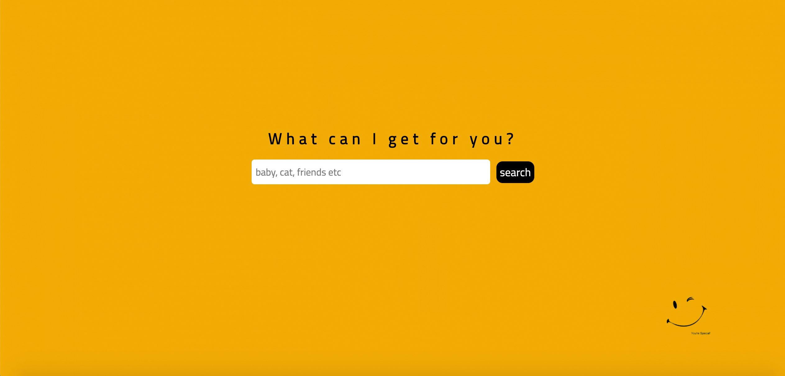
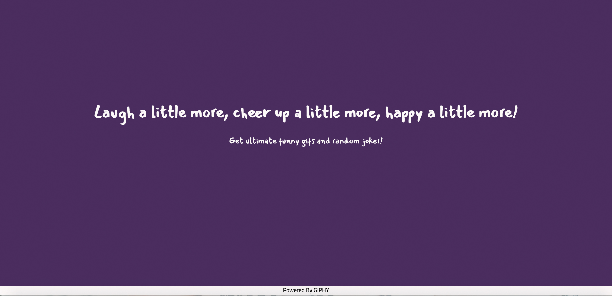
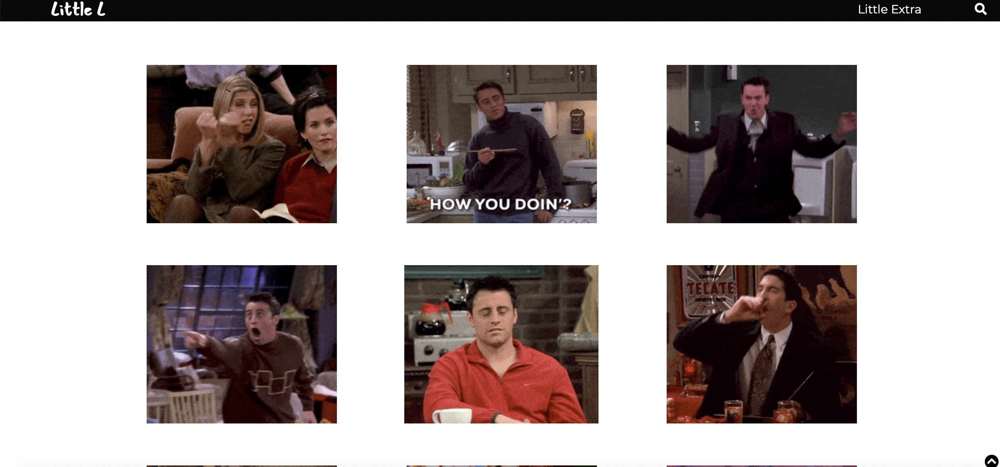
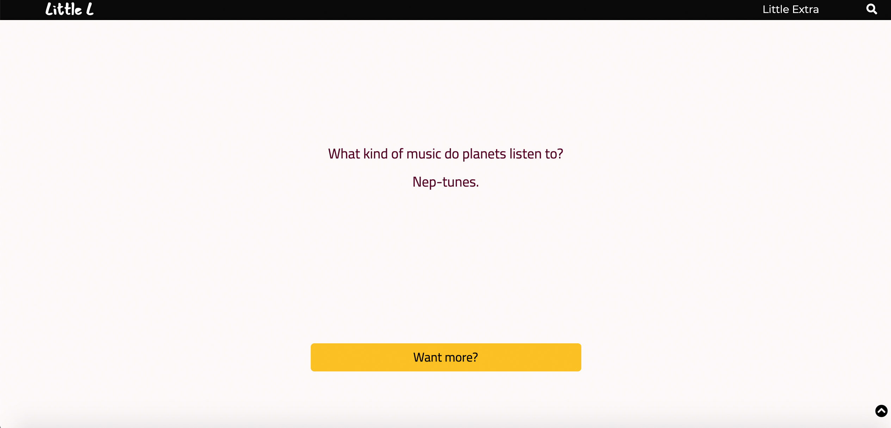

### Laugh a little more, cheer up a little more, happy a little more! Check out my app Little L at:https://seveninjuly.github.io/Little-L-APP/.

This app is a gif search tool with extra random jokes,  when users want to cheer up a little bit, they can open this website and have some fun.
- - - -
Start screen:

About:

Search result:

Restart a new search:

Display jokes:

- - - -
### Features
* On the start screen, users can start a search for different categories of gifs, such as animals, celebrities and so on.
* Users can use the /“want more?”/ button to get new results.
* Click the /search icon/ on the top right corner to start a new search.
* If users want to check out the jokes, the /“Little Extra”/ on the top is there for them to get a random one. 
* Users can always use the /“want more?”/ button to get another joke.
- - - -
This app is built with **HTML, CSS and JavaScript**.
